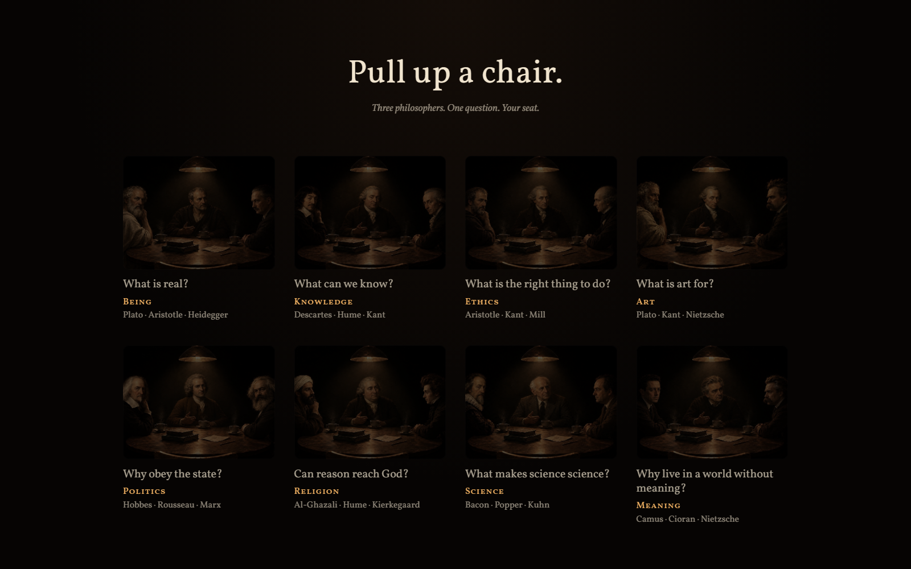
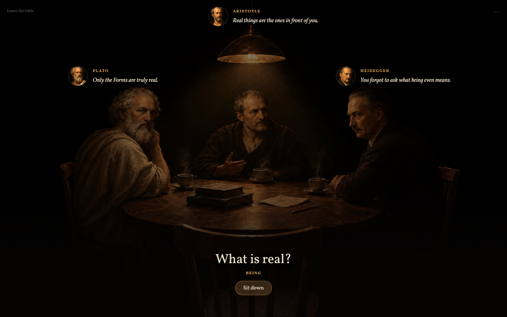
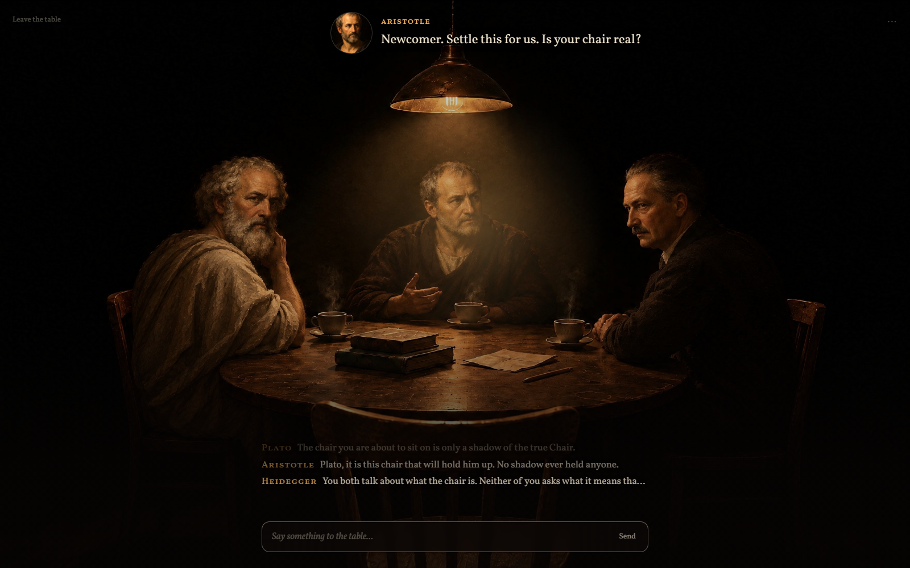
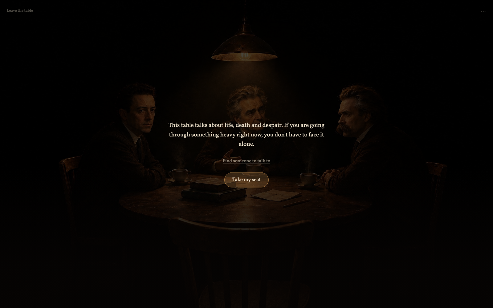

<h1 align="center">Fourth Seat</h1>

<p align="center">Eight tables in a dark room, three philosophers at each, and one empty chair.<br>
You take it.</p>

<p align="center"><b><a href="https://ard0x10.github.io/fourth-seat/">ard0x10.github.io/fourth-seat</a></b></p>



---

Every table is a question. Plato, Aristotle and Heidegger argue about what is real; Camus,
Cioran and Nietzsche ask why anyone should live in a world without meaning. They were
already talking before you sat down, and when you speak, they answer you and each other.

| Table | Question | At the table |
|---|---|---|
| Being | What is real? | Plato, Aristotle, Heidegger |
| Knowledge | What can we know? | Descartes, Hume, Kant |
| Ethics | What is the right thing to do? | Aristotle, Kant, Mill |
| Art | What is art for? | Plato, Kant, Nietzsche |
| Politics | Why obey the state? | Hobbes, Rousseau, Marx |
| Religion | Can reason reach God? | Al-Ghazali, Hume, Kierkegaard |
| Science | What makes science science? | Bacon, Popper, Kuhn |
| Meaning | Why live in a world without meaning? | Camus, Cioran, Nietzsche |

## Standing at the table



Pick a table and the argument is already running: three written openings, played in turn,
with nothing to sign up for and nothing to pay. You can listen at all eight tables and
never say a word.

## Sitting down



To talk back, connect an [OpenRouter](https://openrouter.ai) account. You sign in on
OpenRouter's own page and come back to the same table with your message still in the box.
An account without credits gets the free model; with credits you can choose any model
OpenRouter lists in Settings.

There is no server behind the site. The key OpenRouter gives back is kept in your browser's
local storage, and your messages go from your browser straight to OpenRouter. Disconnect in
Settings forgets the key.

## How a reply is made

Each philosopher is a separate call with their own record: what they hold, who they disagree
with, how they talk. If you name someone, they answer. If you do not, a short first call picks
the one or two the message is really for. Replies stay under about 70 words.

Eleven of the philosophers also bring their own books. The ones whose works can be shared are
cut into passages of about 200 words, and your latest message is used to search them. The
three best passages go to the philosopher to think with, not to recite: a reply that repeats
eight words of a passage in a row, or opens a quotation, has that sentence dropped. Nothing
appears on screen as a quote.

The search runs in a web worker in your browser, and a table's books load only when you sit
at it.

## The books

All 32 works are English translations in the public domain, taken only from a copy whose
printed edition is known:

- printed at least 96 years ago, counted from the current year, and
- every translator dead for at least 81 years.

Prefaces, notes and passages added by later editors are removed. Where a transcription
differs from its printed edition, the scan's page images decide. The rules for each work
live in its philosopher's record in `philosophers/`, and the build refuses a source that
breaks them.

Camus, Cioran, Heidegger, Popper and Kuhn are still under copyright, and no translation of
Kierkegaard or Rousseau passed the rules, so these seven speak from their records alone.

To rebuild `corpus/` from the sources (Python 3, standard library only):

```
python scripts/build-corpus.py
python scripts/build-corpus.py --only kant
```

Downloads are cached in `scripts/.cache/`.

## The Meaning table



The Meaning table talks about life, death and despair, so it says so before you sit down,
every time, with a link to [findahelpline.com](https://findahelpline.com).

## Running it locally

It is a static site. Serve the folder over HTTP; opening `index.html` from disk will not load
the books, because browsers do not start a web worker from a file.

```
python -m http.server 8000
```

## License

Everything in this repository is dedicated to the public domain under
[CC0 1.0 Universal](LICENSE): the code, the philosopher records, the openings, the portraits
and table scenes. Use any of it for anything, with or without credit.

The books in `corpus/` were already in the public domain; they stay there.
